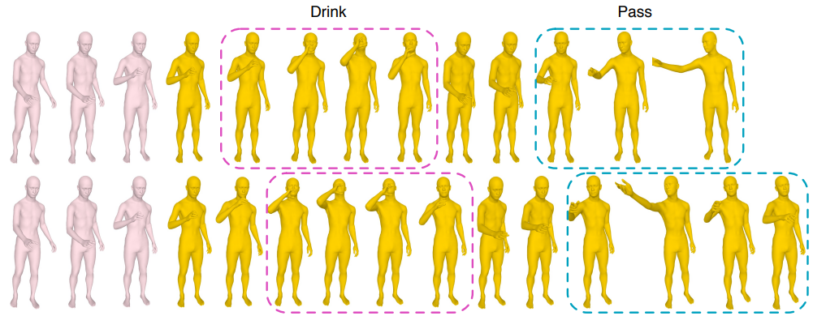

## Weakly-supervised Action Transition Learning for Stochastic Human Motion Prediction


This is official implementation for the paper

[_Weakly-supervised Action Transition Learning for Stochastic Human Motion Prediction_](https://arxiv.org/abs/2205.15608). In CVPR 22.

Wei Mao, Miaomiao Liu, Mathieu Salzmann. 

[[paper](https://arxiv.org/abs/2205.15608)] [[talk](https://www.youtube.com/watch?v=OyG8-DVJfAQ&ab_channel=WeiMao)]

### Dependencies
* Python >= 3.8
* [PyTorch](https://pytorch.org) >= 1.8
* Tensorboard
* numba

tested on pytorch == 1.8.1

### Datasets
#### GRAB dataset
The original dataset is from [here](https://grab.is.tue.mpg.de/).
#### BABEL dataset
The original dataset is from [here](https://babel.is.tue.mpg.de/).
#### NTU13 and HumanAct12
We use the preprocessed version from [Action2Motion](https://github.com/EricGuo5513/action-to-motion).

Note that, we processed all the dataset to discard sequences that are too short or too long. The processed datasets can be downloaded from [GoogleDrive](https://drive.google.com/drive/folders/140d7Bhzy3aUttWuOUBguVLQXJI5b2dou?usp=sharing). Download all the files to ``./data`` folder.

### Training and Evaluation
* We provide YAML configs inside ``motion_pred/cfg``: `[dataset]_rnn.yml` and `[dataset]_act_classifier.yml` for the main model and the classifier (for evaluation) respectively. These configs correspond to pretrained models inside ``results``.
* The training and evaluation command is included in ``run.sh`` file.


### Visualization
Download smpl-(h,x) models from their official websites and put them in ``./SMPL_models`` folder. The data structure should looks like this 
```
SMPL_models
    ├── smpl
    │   ├── SMPL_FEMALE.pkl
    │   └── SMPL_MALE.pkl
    │
    ├── smplh
    │    ├── MANO_LEFT.pkl
    │    ├── MANO_RIGHT.pkl
    │    ├── SMPLH_FEMALE.pkl
    │    └── SMPLH_MALE.pkl
    │
    └── smplx
        │
        ├── SMPLX_FEMALE.pkl
        └── SMPLX_MALE.pkl
```

You can then run the following code to render the results of your model to a video.

```Shell
    python eval_vae_act_render_video.py --cfg grab_rnn --cfg_classifier grab_act_classifier
```


Note that when visualizing the results of BABEL dataset, there may be an error due to the reason that ``SMPLH_(FE)MALE.pkl`` does not contain the hand components. In this case, you may need to manually load the hand components from ``MANO_LEFT(RIGHT).pkl``.

### Citing

If you use our code, please cite our work

```
@inproceedings{mao2022weakly,
  title={Weakly-supervised Action Transition Learning for Stochastic Human Motion Prediction},
  author={Mao, Wei and Liu, Miaomiao and Salzmann, Mathieu},
  booktitle={Proceedings of the IEEE/CVF Conference on Computer Vision and Pattern Recognition},
  pages={8151--8160},
  year={2022}
}
```

### Acknowledgments

The overall code framework (dataloading, training, testing etc.) is adapted from [DLow](https://github.com/Khrylx/DLow). 

### Licence
MIT
